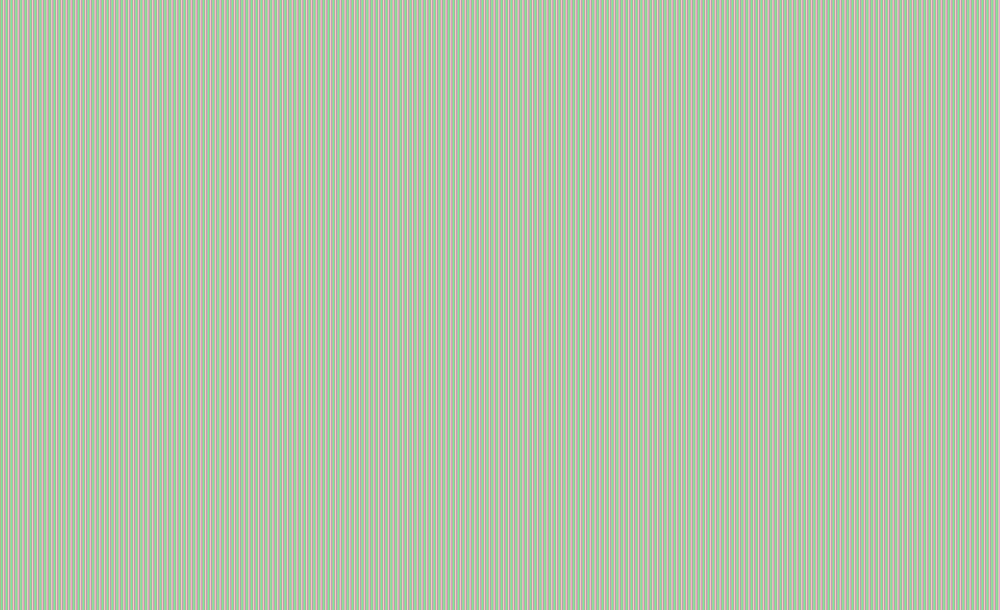
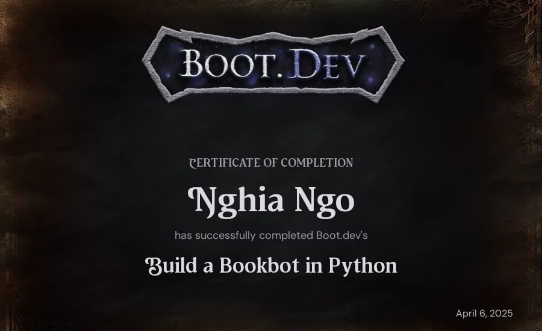
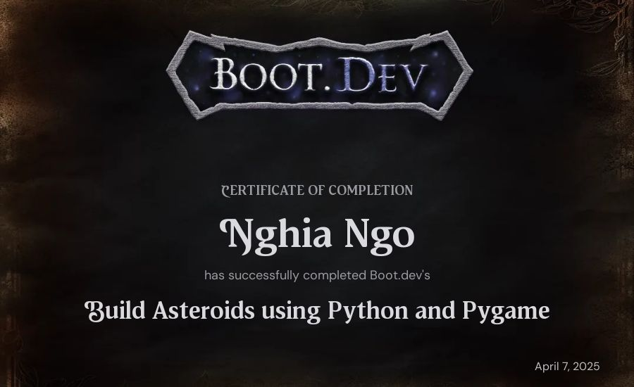

# Boot.dev courses

## bookbot

BookBot is my first [Boot.dev](https://www.boot.dev) project!

And they give me a Certificate after completed it, brighting my day tbh... Our brain just like sinny thing and some number on it. Look like we are progressing into some thing ...

- The download button give me this

  

- So I have to Save image manually

  

## Build Asteroids using Python and Pygame

This is the next project, it quite hard for me as NixOS just refuse to work with pygame like at all - I only see black screen from my code. I tested this on multiple platform, in the final is tested on Window pygame and it still have black screen. So, I revisit the previous lession solution and try to check if I missing something, well it turn out I need to add `pygame.display.flip()` to make it redraw the screen, silly me. Funny enough, the Window code even after added `flip()` still have black screen so I have to goes back to NixOS.

The total of thing I did is way way much to be expected and I endup create a full package and nix-build compatible for asteroids python project. A bit overkill when in really, my code just suck... The step is quite clear also, wonder how I missed that

> Use an infinite while loop for the game loop. At each iteration, it should:
>
> - Use the screen's fill method to fill the screen with a solid "black" color.
> - Use pygame's display.flip() method to refresh the screen. Be sure to call this last!

Turn out it take quite long to finish, but here is the next certificate

